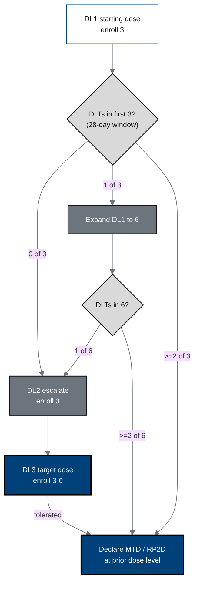

## Figure 10. Daraxonrasib 3+3 dose-escalation scheme

**Caption.** The standard 3+3 escalation for the daraxonrasib drug arm: cohorts
of three advance when no dose-limiting toxicity (DLT) is seen in the 28-day
window, expand to six on a single DLT, and define the maximum tolerated dose
(MTD) and recommended Phase 2 dose (RP2D) at the highest tolerated level.

**Role in the protocol.** Realizes the &sect;6.1.2 dose-escalation/de-escalation
scheme and the &sect;3 primary dose-finding objective.

**Source files.** `nih-protocol/04_study_intervention.md` (dose escalation in
exact doses, DLT rules); `inputs/2030-pdac-1min-final-paper/sections/introduction.tex`
(daraxonrasib eligibility, RASolute 302 anchor).
