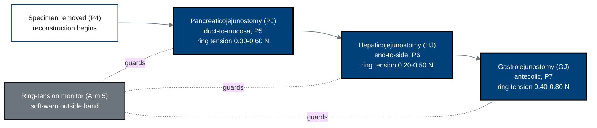

## Figure 11. The three anastomoses and ring-tension targets

**Caption.** The three reconstructive anastomoses with their controller
ring-tension bands: the duct-to-mucosa pancreaticojejunostomy (0.30-0.60 N), the
end-to-side hepaticojejunostomy (0.20-0.50 N), and the antecolic
gastrojejunostomy (0.40-0.80 N), each guarded by the Arm 5 ring-tension monitor
that issues a soft warning outside the band. The pancreaticojejunostomy is the
dominant determinant of postoperative pancreatic-fistula risk.

**Role in the protocol.** Anchors the &sect;8.1 efficacy/feasibility anastomosis
endpoints and the ISGPS fistula-grading safety assessment.

**Source files.** `inputs/2030-pdac-1min-final-paper/sections/methods.tex`
(PJ/HJ/GJ ring-tension targets, anastomosis controllers, ISGPS grading).
