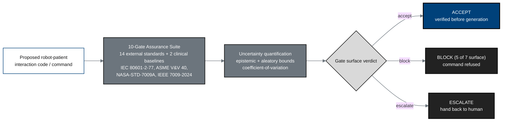

## Figure 12. VVUQ ten-gate assurance pipeline

**Caption.** Verification before generation: every proposed robot-patient
command passes a ten-gate assurance suite aligned to 14 external safety and
robotics standards plus 2 clinical baselines, with epistemic and aleatory
uncertainty bounds, before the gate surface returns ACCEPT, BLOCK, or ESCALATE
(hand back to human). Prior author suites cleared 51 of 51 and 172 of 172 tests.

**Role in the protocol.** Establishes the &sect;6 / &sect;10 assurance basis and the
H. R. 9510 VVUQ legislative alignment.

**Source files.** `research/Gemini-3.1-Pro-19Jun26.md` (ten-gate suite, 1 ACCEPT
/ 5 BLOCK / 1 ESCALATE, standards list, test counts); `inputs/auto-bill-02`
(VVUQ financial and legislative framing).
