## Figure 13. Objectives-to-endpoints hierarchy

```mermaid
%%{init: {'theme':'base','themeVariables':{'fontSize':'12px','lineColor':'#6C757D'}}}%%
flowchart TB
    PRIM["PRIMARY<br/>safety + feasibility"]:::goal
    P1["Incidence of device/procedure-related<br/>serious AEs through 30 days"]:::mid
    P2["MTD / RP2D of daraxonrasib (3+3)"]:::mid
    P3["Procedures completing all assigned<br/>tasks without unsafe conversion"]:::mid
    SEC["SECONDARY"]:::goal
    S1["R0 resection rate"]:::light
    S2["ISGPS B/C pancreatic fistula rate"]:::light
    S3["Clavien-Dindo III+ ; 30/90-day mortality"]:::light
    EXP["EXPLORATORY"]:::goal
    E1["PFS and OS (24-month)"]:::light
    E2["LLM advisory concordance ; sim-to-real gap"]:::light
    PRIM --> P1 & P2 & P3
    SEC --> S1 & S2 & S3
    EXP --> E1 & E2
    classDef goal fill:#00417A,stroke:#000000,stroke-width:2px,color:#FFFFFF
    classDef mid fill:#6C757D,stroke:#111111,stroke-width:1.5px,color:#FFFFFF
    classDef light fill:#FFFFFF,stroke:#00417A,stroke-width:1.2px,color:#111111
```

**Caption.** The objective-endpoint hierarchy: primary safety and feasibility
(30-day serious AE incidence, daraxonrasib MTD/RP2D, unsafe-conversion-free task
completion), secondary oncologic-surgical quality (R0 rate, ISGPS B/C fistula,
Clavien-Dindo III+, mortality), and exploratory progression-free and overall
survival plus LLM-advisory concordance and the sim-to-real gap.

**Role in the protocol.** Drives the &sect;3 three-column Objectives-Endpoints
table and the &sect;9 analysis plan.

**Source files.** `nih-protocol/02_objectives_and_endpoints.md` (three-column
table); `research/ChatGPT-5.5-Thinking-Extended-19Jun26.md` (30-day SAE primary,
task-completion feasibility); `inputs/2030-pdac-1min-final-paper/sections/results.tex`.
