## Figure 14. Schedule of Activities visit map

```mermaid
%%{init: {'theme':'base','themeVariables':{'fontSize':'12px','lineColor':'#6C757D'}}}%%
flowchart LR
    SCR["Screening<br/>Day -28 to -1<br/>consent, staging, KRAS,<br/>CA 19-9, ECOG, labs"]:::light
    BASE["Baseline / Day -1<br/>Phase 0 sim sign-off,<br/>USL + safety matrix"]:::mid
    SURG["Surgery Day 0<br/>robotic Whipple,<br/>intra-op telemetry"]:::goal
    ACUTE["Acute Day 1-7<br/>fistula (ISGPS), drains,<br/>daraxonrasib restart advisory"]:::mid
    D30["Day 30<br/>primary SAE window,<br/>Clavien-Dindo"]:::goal
    D90["Day 90<br/>90-day mortality,<br/>R0 pathology"]:::mid
    LT["Long-term q12wk<br/>PFS, OS to 24 months"]:::goal
    SCR --> BASE --> SURG --> ACUTE --> D30 --> D90 --> LT
    classDef goal fill:#00417A,stroke:#000000,stroke-width:2px,color:#FFFFFF
    classDef mid fill:#6C757D,stroke:#111111,stroke-width:1.5px,color:#FFFFFF
    classDef light fill:#FFFFFF,stroke:#00417A,stroke-width:1.2px,color:#111111
```

**Caption.** The visit structure underlying the Schedule of Activities grid:
28-day screening, a baseline day carrying the Phase 0 simulation sign-off and the
USL/safety-matrix verification, surgery day 0, the acute day 1-7 window (fistula
grading, drains, daraxonrasib restart advisory), the day-30 primary safety
window, day-90 mortality and R0 pathology, and long-term q12-week follow-up to
24-month overall survival.

**Role in the protocol.** Becomes the &sect;1.3 Schedule of Activities and binds
each assessment in &sect;8 to a timepoint.

**Source files.** `nih-protocol/01_statement_of_compliance_protocol_summary_introduction.md`
(Schedule of Activities); `research/ChatGPT-5.5-Thinking-Extended-19Jun26.md`
(acute / 30-day / longer-term follow-up); `inputs/2030-pdac-1min-final-paper/sections/introduction.tex`.
