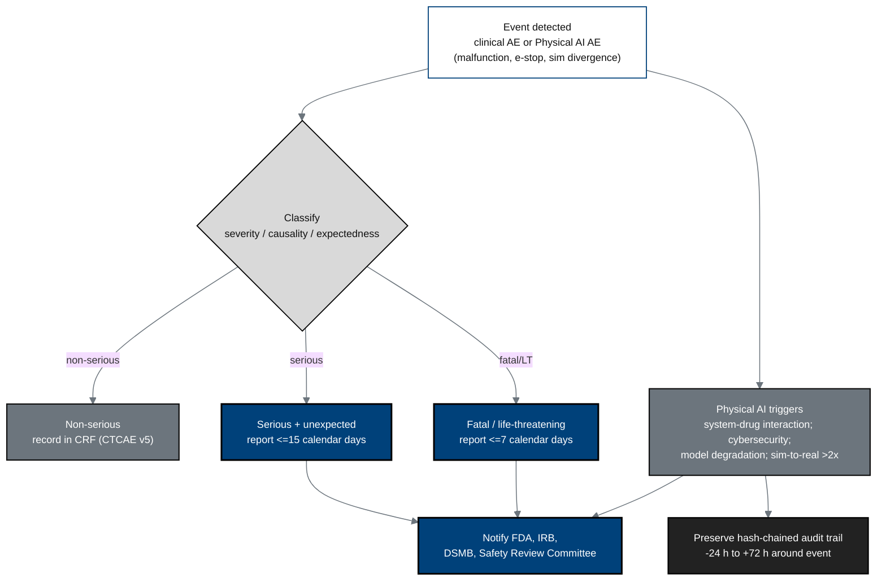

## Figure 15. Adverse-event and Physical AI AE reporting workflow

**Caption.** Parallel pharmacovigilance and Physical AI safety reporting: clinical
events are graded by CTCAE v5 and reported on the 15-day (serious, unexpected) or
7-day (fatal, life-threatening) IND/IDE timelines, while Physical AI triggers
(system-drug interaction, cybersecurity, model degradation, sim-to-real divergence
beyond twice tolerance) add their own reports, each preserving the hash-chained
audit trail from 24 hours before to 72 hours after the event.

**Role in the protocol.** Operationalizes &sect;8.3 AE/SAE and the &sect;312.32(g)
Physical AI reporting machinery.

**Source files.** `inputs/21cfr312_adapt/03_protocol_amendments_reporting.tex`
(7/15-day timelines, 6 Physical AI triggers, -24h/+72h audit window);
`nih-protocol/06_study_assessments_and_procedures.md` (AE/SAE classification).
