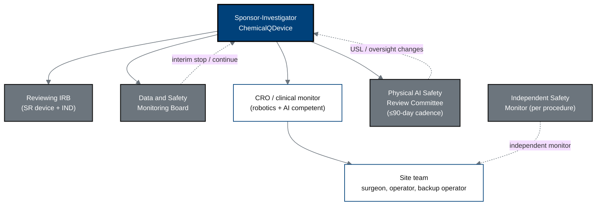

## Figure 16. Study governance and safety oversight

**Caption.** The oversight architecture: the Sponsor-Investigator answers to the
reviewing IRB and a Data and Safety Monitoring Board, convenes a Physical AI
Safety Review Committee on a &le;90-day cadence, designates an Independent Safety
Monitor for each procedure, and delegates monitoring to a robotics- and
AI-competent CRO over the site team (surgeon, operator, and a qualified backup
operator).

**Role in the protocol.** Structures &sect;10.1.5 governance and &sect;10.1.6 safety
oversight.

**Source files.** `inputs/21cfr312_adapt/{03_protocol_amendments_reporting,04_annual_reports_withdrawal}.tex`
(Safety Review Committee, sponsor/CRO/investigator duties);
`nih-protocol/{08_supporting_documentation_regulatory_oversight,10_references_and_footnotes}.md` (DSMB/ISM definitions).
