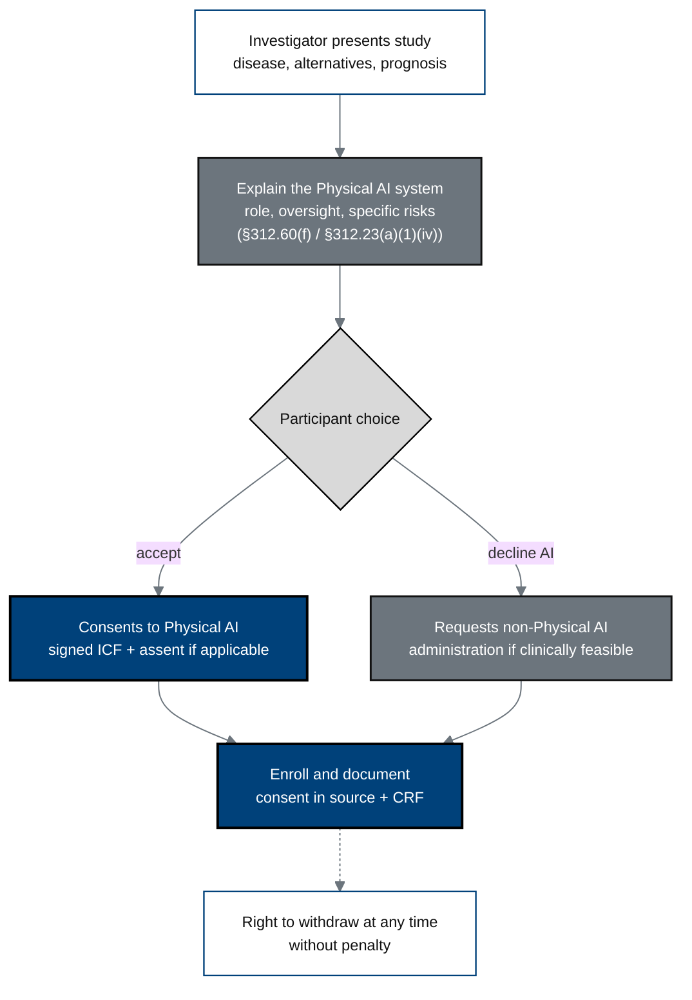

## Figure 17. Informed-consent process with the Physical AI opt-out

**Caption.** Consent explicitly discloses the Physical AI system's role,
continuous human oversight, and system-specific risks, and offers the
participant a documented right to request non-Physical AI administration where
clinically feasible (21 CFR §312.60(f)), with the standard right to withdraw at
any time without penalty.

**Role in the protocol.** Defines &sect;10.1.1 the informed-consent process and the
Physical AI opt-out unique to this trial class.

**Source files.** `inputs/21cfr312_adapt/05_clinical_holds_appendices_closing.tex`
(&sect;312.60(f) Physical AI consent and opt-out);
`nih-protocol/08_supporting_documentation_regulatory_oversight.md` (consent process).
