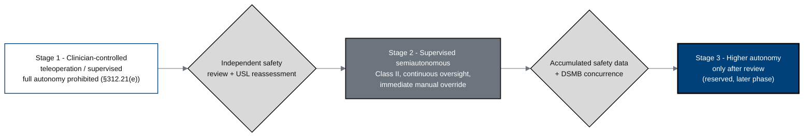

## Figure 18. Staged autonomy model (phase-graduated)

**Caption.** Autonomy increases only through gated review: this Phase 1 protocol
operates at clinician-controlled and supervised semiautonomous levels (Class II,
continuous oversight with immediate manual override; full autonomy prohibited per
21 CFR §312.21(e)), and any move to higher autonomy requires an independent
safety review, a USL reassessment, and DSMB concurrence, reserved for a later
phase.

**Role in the protocol.** Frames the &sect;4.1 design and the &sect;6.3
autonomy-level controls.

**Source files.** `inputs/21cfr312_adapt/02_ind_content_phases.tex`
(phase-graduated autonomy, &sect;312.21(e)); `research/ChatGPT-5.5-Thinking-Extended-19Jun26.md`
(staged-autonomy cohorts).
