## Figure 19. Three counterfactual scenarios: withholding LLM + robot + medicine shortens PFS and OS

```mermaid
%%{init: {'theme':'base','themeVariables':{'fontSize':'11px','lineColor':'#6C757D'}}}%%
flowchart TB
    subgraph A["Scenario A - resection-window collapse"]
      A0["Borderline-resectable PDAC<br/>tumor abuts SMV at 75 deg"]:::light
      AH["Human-only scheduling delay<br/>(OR access, fatigue, staging lag)"]:::warn
      AHX["Progression to unresectable<br/>R0 window closes -> shorter PFS/OS"]:::dark
      AC["LLM + robot rapid precise resection<br/>within window -> R0 achieved"]:::goal
      A0 --> AH --> AHX
      A0 --> AC
    end
    subgraph B["Scenario B - vascular-injury cascade"]
      B0["Intra-op SMV/PV plane"]:::light
      BH["Unrecognized venous injury<br/>(manual, no zone gate)"]:::warn
      BHX["Hemorrhage -> conversion -> R1/R2<br/>fistula-sepsis-failure to rescue"]:::dark
      BC["No-fly gate + <=3 ms E-stop<br/>injury averted -> complete resection"]:::goal
      B0 --> BH --> BHX
      B0 --> BC
    end
    subgraph C["Scenario C - drug-restart mistiming"]
      C0["Perioperative daraxonrasib"]:::light
      CH["Manual mistiming<br/>too early or too late"]:::warn
      CHX["Dehiscence or micrometastatic<br/>outgrowth -> shorter PFS/OS"]:::dark
      CC["LLM advisory T+7/T+14/T+21<br/>keyed to fistula + trough"]:::goal
      C0 --> CH --> CHX
      C0 --> CC
    end
    classDef goal fill:#00417A,stroke:#000000,stroke-width:2px,color:#FFFFFF
    classDef warn fill:#D9D9D9,stroke:#000000,stroke-width:1.2px,color:#111111
    classDef light fill:#FFFFFF,stroke:#00417A,stroke-width:1.2px,color:#111111
    classDef dark fill:#222222,stroke:#000000,stroke-width:1.5px,color:#FFFFFF
```

**Caption.** Three advanced-PDAC scenarios in which withholding the combination
worsens the patient: (A) human-only scheduling delay lets a borderline-resectable
tumor progress to unresectable and closes the R0 window; (B) an unrecognized
superior-mesenteric/portal-vein injury during manual surgery triggers the
hemorrhage-conversion-fistula-sepsis-failure-to-rescue cascade; and (C) manual
mistiming of the daraxonrasib restart causes anastomotic dehiscence or
micrometastatic outgrowth. In each, the LLM-plus-robot-plus-medicine path
(precise in-window resection, no-fly gate with &le;3 ms E-stop, advisory restart)
preserves progression-free and overall survival.

**Role in the protocol.** Anchors the &sect;2.1 Study Rationale and &sect;2.3
Risk/Benefit Assessment; the central clinical argument for this trial class.

**Source files.** `inputs/2030-pdac-1min-final-paper/sections/{introduction,discussion}.tex`
(vessel angle, fistula cascade, advisory windows); `research/Gemini-3.1-Pro-19Jun26.md`
(PDAC pilot rationale); `research/ChatGPT-5.5-Thinking-Extended-19Jun26.md` (expanded-access framing).
