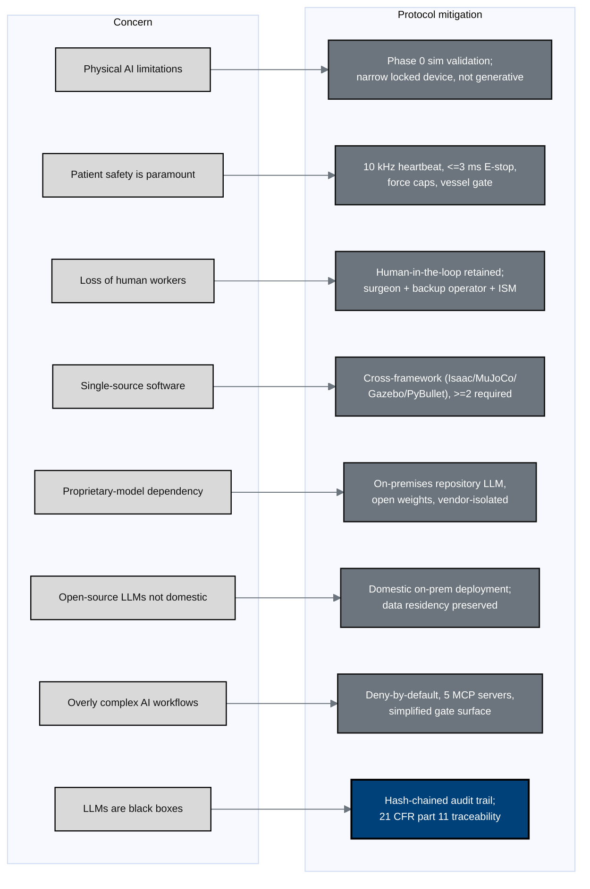

## Figure 20. Eight Physical AI concerns and their protocol mitigations

**Caption.** Each of the eight Physical AI concerns is paired with a concrete
protocol mitigation: validated narrow device behavior over generative
open-endedness, layered hard safety limits, retained human roles, multi-framework
(non-single-source) validation, an on-premises open-weights LLM isolated from the
vendor stack, domestic deployment with preserved data residency, a deny-by-default
simplified workflow, and a 21 CFR part 11 hash-chained audit trail that makes the
black box traceable.

**Role in the protocol.** Forms the &sect;2.2 Background subsection on Physical AI
concerns and recurs in &sect;10 oversight.

**Source files.** `research/{ChatGPT-5.5-Thinking-Extended-18Jun26,Gemini-3.1-Pro-18Jun26}.md`
(LLM black-box, single-source, proprietary, domestic concerns);
`inputs/21cfr312_adapt/01_preamble_scope_definitions.tex` (4 sim frameworks, MCP, audit trail);
`inputs/author_works.bib` (`Kawchak2025CodeGenerationCompetition16` open vs proprietary).
