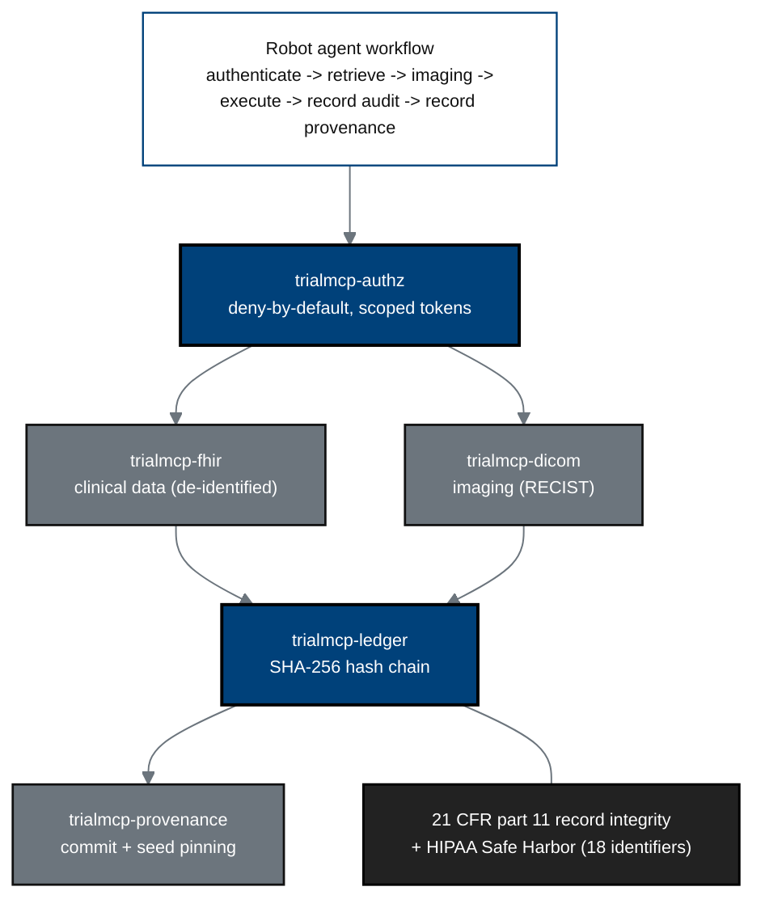

## Figure 21. Hash-chained audit trail and deny-by-default data flow

**Caption.** The six-step robot-agent workflow accesses clinical and imaging data
only through deny-by-default, scope-limited tokens (trialmcp-authz), with every
action written to a SHA-256 hash-chained ledger and pinned to a commit and seed
(provenance), satisfying 21 CFR part 11 record integrity and HIPAA Safe Harbor
de-identification of all 18 identifiers. This is the auditable answer to the
black-box concern.

**Role in the protocol.** Realizes &sect;10.1.3 confidentiality/privacy and
&sect;10.1.9 data handling, and the &sect;6 MCP integration description.

**Source files.** `inputs/21cfr312_adapt/01_preamble_scope_definitions.tex`
(5 MCP servers, 6-step workflow, hash chain, deny-by-default, HIPAA Safe Harbor);
`research/Gemini-3.1-Pro-19Jun26.md` (tamper-evident audit trail).
