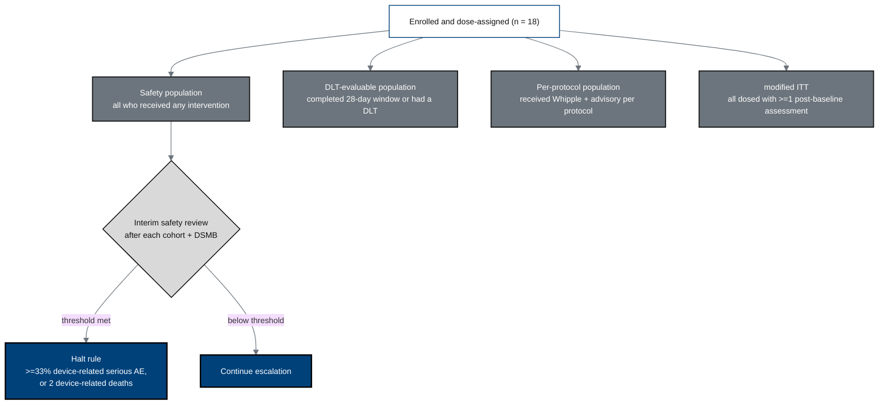

## Figure 22. Statistical analysis populations and interim stopping logic

**Caption.** The four analysis populations (safety, dose-limiting-toxicity
evaluable, per-protocol, modified intention-to-treat) and the cohort-level interim
safety review with prespecified DSMB halt rules (for example, a device-related
serious-AE rate at or above one third, or two device-related deaths).

**Role in the protocol.** Defines &sect;9.3 populations and &sect;9.4.6 interim
analyses / stopping logic.

**Source files.** `nih-protocol/07_statistical_considerations.md` (populations,
interim analysis); `research/ChatGPT-5.5-Thinking-Extended-19Jun26.md`
(30-day serious-AE primary safety endpoint).
