## Figure 23. Author-works LLM-trust timeline (Aug 2024 to Jun 2026)

```mermaid
%%{init: {'theme':'base','themeVariables':{'fontSize':'11px','lineColor':'#6C757D'}}}%%
flowchart LR
    T1["Aug-Dec 2024<br/>LMM chemistry + bioprocess<br/>foundational conversational AI"]:::light
    T2["Jan-Jun 2025<br/>cancer trial cost + decision support;<br/>PDAC digital-twin proposals"]:::mid
    T3["Jul-Oct 2025<br/>100k-patient in silico Phase III;<br/>QSP PDAC VVUQ playbook"]:::mid
    T4["Nov 2025-Feb 2026<br/>glioblastoma drug-synergy ML;<br/>federated learning unification"]:::mid
    T5["Mar-Jun 2026<br/>21 CFR adaptations; Unitree H2 humanoid;<br/>H. R. 9510 bill; 60-second Whipple"]:::goal
    T1 --> T2 --> T3 --> T4 --> T5
    classDef goal fill:#00417A,stroke:#000000,stroke-width:2px,color:#FFFFFF
    classDef mid fill:#6C757D,stroke:#111111,stroke-width:1.5px,color:#FFFFFF
    classDef light fill:#FFFFFF,stroke:#00417A,stroke-width:1.2px,color:#111111
```

**Caption.** Twenty-two months of the author's published LLM and oncology work,
from foundational conversational-AI chemistry (2024) through pancreatic-cancer
digital twins and large in-silico trials (2025) to the 21 CFR adaptations, the
surgical humanoid, the H. R. 9510 bill, and the sixty-second Whipple simulation
(2026). This record establishes the LLM trust that makes the present protocol a
valid candidate for consideration.

**Role in the protocol.** Supports the &sect;2.2 Background claim of established
LLM trust; cited briefly, not exhaustively.

**Source files.** `inputs/author_works.bib` (43 entries, Aug 2024 - Jun 2026,
grouped by theme).
