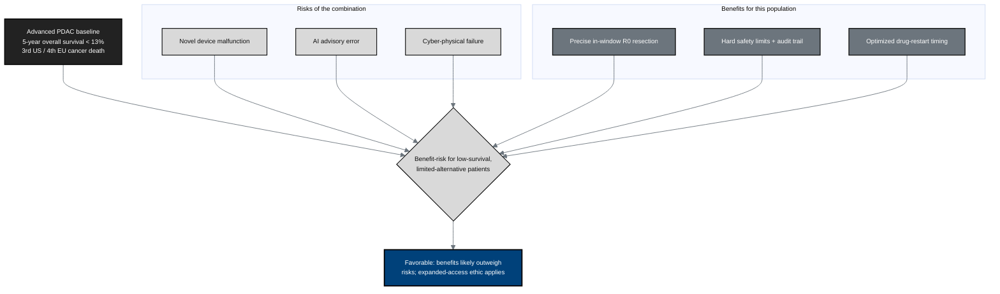

## Figure 24. Risk-benefit framework for advanced and terminally ill PDAC patients

**Caption.** Against a baseline of under-13-percent five-year survival and few
alternatives, the novel risks (device malfunction, advisory error, cyber-physical
failure) are weighed against the benefits (precise in-window R0 resection, layered
hard safety limits with a full audit trail, optimized drug timing). For this
low-survival, limited-alternative population the benefit-risk balance is
favorable, consistent with the expanded-access ethic.

**Role in the protocol.** Structures the &sect;2.3.3 Assessment of Potential Risks
and Benefits.

**Source files.** `inputs/2030-pdac-1min-final-paper/sections/introduction.tex`
(PDAC epidemiology, < 13% 5-year survival); `research/ChatGPT-5.5-Thinking-Extended-19Jun26.md`
(expanded access / compassionate use); `inputs/21cfr312_adapt/02_ind_content_phases.tex` (&sect;312.84 risk-benefit).
