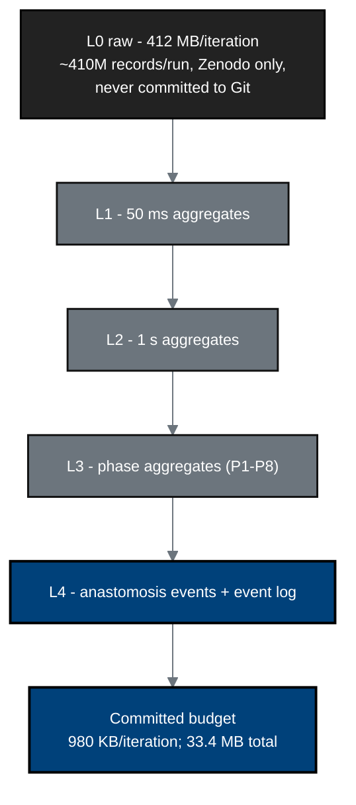

## Figure 25. Sensor-data pyramid and provenance retention

**Caption.** The provenance pyramid: raw L0 telemetry (412 MB per iteration,
roughly 410 million records per run) stays on Zenodo and is never committed,
while progressively coarser L1-L4 aggregates (50 ms, 1 s, phase, and anastomosis
events) fit a 980 KB-per-iteration committed budget (33.4 MB total). Raw data is
decompressible to human-readable form on FDA request per &sect;312.57.

**Role in the protocol.** Supports &sect;10.1.9 data handling/record keeping and the
&sect;312.57 telemetry-retention requirement.

**Source files.** `inputs/2030-pdac-1min-final-paper/sections/{results,limitations_future}.tex`
(L0-L4 pyramid, file-size budget, ~410M records);
`inputs/21cfr312_adapt/04_annual_reports_withdrawal.tex` (&sect;312.57 telemetry retention).
